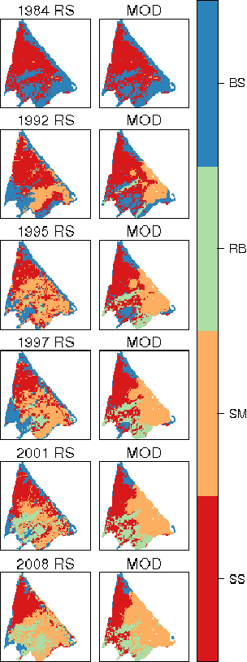

# Model results and validation

The model serves as a research tool for testing plant community interactions and the relationships between plant communities and environmental variables in space and time. The model is easy to interpret, is mainly based on deterministic empirical data, and is openly accessible and easily reproducible. Furthermore, by means of the R library, the model could be extended by other researchers in order to include other conceptual wetland models of soil-plant relationships, as well as addressing broader topics, such as the distribution, morphology and habitats of saline wetlands. Additionally, the model could act as a scientific assessment tool to assist diverse environmental agencies in studying the responses of wetland plant communities to watershed agricultural pressures.

Wetlands are complex ecosystems exhibiting strong spatial heterogeneity, which makes them hard to study. Therefore, including the spatial dimension of the main model parameters and state variables allowed us to better understand the distribution of each plant community type in response to the selected pressures. Results of the model clearly show the influence on this type of wetland of the expansion of irrigated agricultural areas in their watersheds. This explains the fact that conventional management strategies which ignore the hydrological processes occurring at watershed scale usually fail the protection and conservation goals of this type of ecosystem.

The relative changes between salt steppe, salt marsh and reed beds can be probably explained by the interaction between soil moisture and conductivity gradients. The initial increase of water inflows from the basin resulted in increased soil moisture and higher salinity, which favored the expansion of salt marsh at the expense of salt steppe. At a later stage, around 1995, the increased water inputs reduced water salinity and allowed the expansion of reed beds. The net loss of salt steppe is very important since it is the habitat of Mar Menor wetlands with the highest interest from the point of view of the European Habitat Directive.

Wetland plant community maps from years 1992, 1995, 1997, 2001 and 2008, obtained by means of remote sensing, with an overall accuracy ranging from 74% to 89%, were used as independent validation data for assessing the results of the model (Figure 10). Remote sensing maps were validated using field and aerial image data. Mutiple-resolution-goodness-of-fit was performed for each validation year, comparing between the plant community maps resulting from the model and the ones obtained by means of remote sensing.

