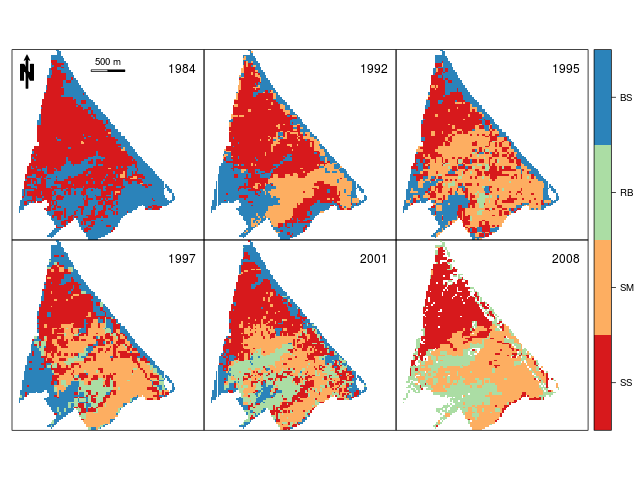

# What is this model about?

## The spdynmod model

Semiarid Mediterranean saline wetlands are semi-terrestrial ecosystems, which yearly undergo dry periods of several months, and shelter a rich, endemic and sensitive biota. In the last decades, the expansion of agricultural irrigated areas in semiarid Mediterranean catchments has led to altered inputs of water and nutrients to lowland wetlands. Hydrological alterations have affected characteristic plant communities, resulting in the replacement of valuable halophilic salt marsh and salt steppe plant communities by more generalist and opportunistic taxa, such as *Phragmites australis* (reed beds) (figure 1). A spatio-dynamic model and library were developed that aimed to explain the spatial distribution of three characteristic wetland plant communities in a semiarid Mediterranean wetland site in response to hydrological pressures from the catchment.

 Wetland plant communities and watershed irrigated agricultural areas were mapped by means of remote sensing at several dates between 1984 and 2008 and were partly used as forcing inputs and validation data (figures 2 and 3). A dynamic model was initially developed using Stella software and then converted into R language by means of the [StellaR](http://www.r-gis.net/stellar/) software. Spatial dimension was added including neighborhood and spatial flow algorithms representing the dispersion of plant communities.

The conversion between plant communities was caused by the increase in water inflows from the watershed, mediated by spatial parameters, such as the distance to ephemeral rivers and the flow accumulation map within the wetland site. Results of the model were in agreement with remote sensing data, showing that in 2008 salt steppe had lost a half of its original area, whereas salt marsh and reed beds expanded extensively.

The model developed in this study is available online as an [R library](https://cran.r-project.org/web/packages/spdynmod/index.html), including all necessary input data sets and maps and documentation to run it. The model library offers a flexible tool that suits the needs of both advanced modelers and neophytes. Free and open source software and online code sharing repositories are proposed as modelling tools for future research.
